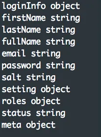
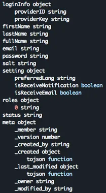

import Link from '/src/components/Link';
import Figure from '/src/components/Figure';
import BZhan from '/src/components/BZhan';

## 前言
MongoDB是一个基于分布式文件存储的开源数据库系统，其内容存储格式为BSON（一种类json的二进制形式），其主要特点是高性能、易部署、易使用，存储数据支持高度事务性且支持完全索引，包括地理空间索引、散列索引和全文索引，还有一个比较大的优势是其适应于海量数据的存储，其数据被分散在不同的服务器上，以自动分区数据。

MongoDB在实际生产环境中有很多应用场景，利用器BSON数据结构可以在运行期动态扩展数据Schema。

MongoDB被TIS整合进了数据集成方案，通过TIS中可以**方便对MongoDB端进行读取或者写入操作**，方便实现对MongoDB的数据迁移、实时容灾备份、异构数据端（如：Doris）实时同步实现复杂OLAP操作。

本文就实际操作过程中，发现从MongoDB中不能预先读取表Schema，对此进行了优化，并且对此优化过程作以详细介绍。

## 发现瓶颈
MongoDB作为文档型数据库的代表，区别于传统关系型数据库MySQL，MongoDB的表数据结构Schema在运行期是可变的，而不是像MySQL那样通过Create Table DDL预先定义好表Schema。因此，在为MongoDB做数据集成操作时带来一个麻烦事儿，需要通过手工配置的方式
为读取MongoDB的表作为依据。例如，用户通过Alibaba DataX来读取MongoDB需编写DataX Reader任务配置：
```json title="https://github.com/alibaba/DataX/blob/master/mongodbreader/doc/mongodbreader.md"
  {
  "job": {
    "content": [
      {
        "reader": {
          "name": "mongodbreader",
          "parameter": {
            "address": ["127.0.0.1:27017"],
            "dbName": "tag_per_data",
            "collectionName": "tag_data12",
            "column": [
              {
                "name": "unique_id",
                "type": "string"
              },
              {
                "name": "sid",
                "type": "string"
              },
              {
                "name": "user_id",
                "type": "string"
              },
              {
                "name": "auction_id",
                "type": "string"
              },
              {
                "name": "content_type",
                "type": "string"
              },
              {
                "name": "pool_type",
                "type": "string"
              }
            ]
          }
        },
        "writer": {
          "name": "odpswriter"
        }
      }
    ]
  }
}
```

以上配置文件中 reader `mongodbreader`需要配置对应表的列枚举信息，列中存在`BSON`类型的列，还存在拆列的问题，会更加复杂，配置过程虽然简单，但还是很容易会出错，特别在配置`type`属性时。

## 优化

### 思路
优化思路，是否可以通过MongoDB的JDBC客户端，通过反射的方式得到表的列信息列表。然后通过模版机制（如：velocity）自动生成DataX配置文件中`column`配置。

尝试通过MongoDB Client API读取表Schema元数据信息，我们可以尝试从collection中读取一条记录，然后通过解析记录获得Schema记录，如下：

```javascript
  var schemaObj = db.users.findOne();
```

遍历记录的所有列
```javascript
  void printSchema(obj) {
        for (var key in obj) {
            print(indent, key, typeof obj[key]) ;
        }
  };
```
可以将Schema打印出，如下：<br/><br/>


这非常酷，而用户自定义Collection往往存在子属性，希望将这些子属性进行拆接打平，可以导入到下游目标端中。

我们可以优化以上代码：
```javascript
function printSchema(obj, indent) {
        for (var key in obj) {
            print(indent, key, typeof obj[key]) ;
            if (typeof obj[key] == "object") {
                printSchema(obj[key], indent + "\t")
            }
        }
    };
printSchema(schemaObj,"");
```
重新执行以上代码，将会打印：<br/><br/>


- 参考： https://medium.com/@ahsan.ayaz/how-to-find-schema-of-a-collection-in-mongodb-d9a91839d992

### 在TIS中具体实现

TIS中读取MongoDB表Schema实现方式沿袭以上思路，另外添加额外的工序：
1. 在控制台中设置尝试读取的记录数，由于MongoDB Collection中每条记录的列数量和类型不一定相同的，可以尝试读取多条Collection中记录，将每条记录Schema进行Merge最终获得Schema。
2. 读取每条记录类型为`BsonType.DOCUMENT`的列类型，将内部子列与父列通过'.'号就行连接，打平成为新的列,例如："user.name","user.age"
3. 将获得到的Schema在前台展示，用户可以通过在表单中对Schema结构进行微调，以确认最终的Schema结构。


以下为 [MongoColumnMetaData.java](https://github.com/qlangtech/plugins/blob/b728488cc198661e6657cc174b4326495f9d5e6d/tis-datax/tis-datax-mongodb-plugin/src/main/java/com/qlangtech/tis/plugin/datax/mongo/MongoColumnMetaData.java#L69) GitHub中路径代码中的片段：

```java title="/tis-datax-mongodb-plugin/src/main/java/com/qlangtech/tis/plugin/datax/mongo/MongoColumnMetaData.java#L69"
    public static void parseMongoDocTypes(boolean parseChildDoc, List<String> parentKeys //
            , Map<String, MongoColumnMetaData> colsSchema, BsonDocument bdoc) {
        int index = 0;
        BsonValue val;
        String key;
        MongoColumnMetaData colMeta;
        List<String> keys = null;

        for (Map.Entry<String, BsonValue> entry : bdoc.entrySet()) {
            val = entry.getValue();
            keys = ListUtils.union(parentKeys, Collections.singletonList(entry.getKey()));
            key = String.join(MongoCMeta.KEY_MONOG_NEST_PROP_SEPERATOR, keys);
            colMeta = colsSchema.get(key);
            if (colMeta == null) {
                colMeta = new MongoColumnMetaData(index++, key, val.getBsonType(), 0,
                        (val.getBsonType() == BsonType.OBJECT_ID));
                colsSchema.put(key, colMeta);
            } else {
                if (colMeta.getMongoFieldType() != BsonType.STRING //
                        && !val.isNull() && colMeta.getMongoFieldType() != val.getBsonType()) {
                    //TODO： 前后两次类型不同
                    // 则直接将类型改成String类型
                    colMeta = new MongoColumnMetaData(index++, key, BsonType.STRING);
                    colsSchema.put(key, colMeta);
                }
            }
            if (!val.isNull()) {
                if (colMeta.getMongoFieldType() == BsonType.DOCUMENT && val.isDocument()) {
                    parseMongoDocTypes(true, keys, parseChildDoc ? colsSchema : colMeta.docTypeFieldEnum, val.asDocument());
                }
                if (colMeta.getMongoFieldType() == BsonType.STRING) {
                    colMeta.setMaxStrLength(val.asString().getValue().length());
                }
                colMeta.incrContainValCount();
            }

        }
    }
```
MongoDB Reader 页面设置`预读记录数`，尝试读取Collection记录条数以分析出Collection的Schema，为确保最终Schema准确，可以适当将`预读记录数`设置得大一些。


<Figure img={require('./set-count-of-ready-read.png')}/>


通过TIS解析得到的Schema会在以下页面中展示结果，用户可进行微调，确定是否需要该列，变更字段类型等。

<Figure img={require('./confirm-collection-schema.png')}/>
通过以上优化，最终完成数据同步通道定义，可以有效避免用户手动输入MongoDB表 Schema，达到了最大限度地降低了出错概率，且提高了工作效率

## 总结

数据集成领域，有大部分的端类型是和MongoDB类似属于 Schemaless的，例如Kafka，Redis，基于文件的Hdfs，FTP等等。不像MySQL这样的具有明确预定义Schema的数据源可以通过读取MetaData的方式得到Schema，从而进行自动化操作。

TIS的初衷是构建一款高度傻瓜化的DataOps数据集成软件，面向一线非技术人员，他们精通业务，在具体操作过程中不需要了解具体MongoDB中的字段类型，有哪些字段。
整个操作流程，只需要轻点鼠标，TIS会帮助用户自动生成所需配置。

借鉴这种操作思路，可以扩展到其他Schemaless的数据端读取流程上，例如Kafka，Redis，基于文件的Hdfs，FTP，将会极大地提高执行数据集成的效率。

