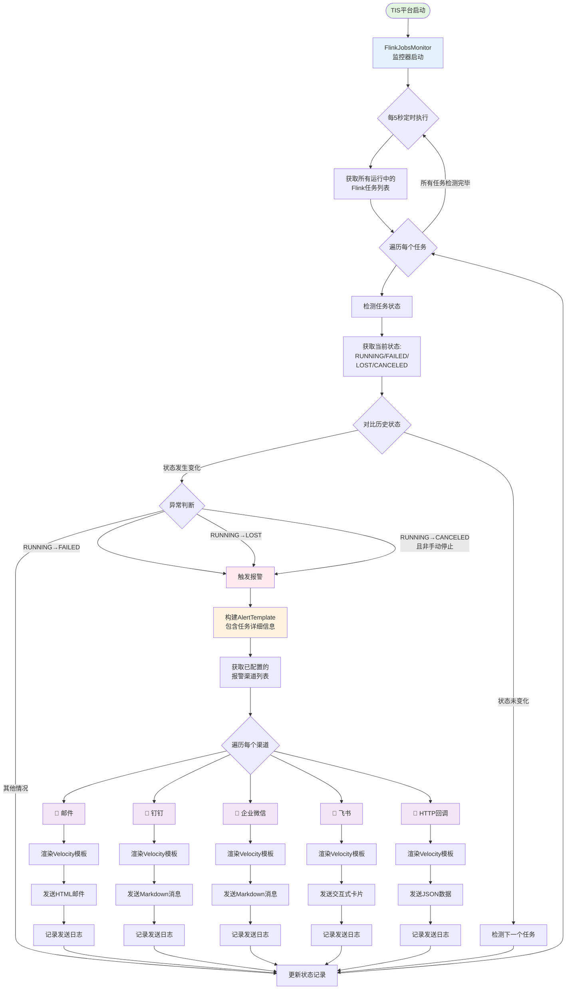

import Link from '/src/components/Link';
import Figure from '/src/components/Figure';

## 引言

在数字化转型的今天,企业越来越依赖实时数据处理来支撑业务决策。然而,实时任务一旦出现故障,可能导致数据丢失、业务中断等严重后果。传统的做法是安排专人盯盘监控,这不仅效率低下,而且无法做到24小时不间断监控。

TIS平台最新上线的**Flink任务智能监控与报警系统**,彻底解决了这一痛点。系统能够自动发现任务异常,并第一时间通过钉钉、企业微信、邮件等多种方式通知相关人员,真正做到"任务有问题,立即能知道"。

<!-- 插图位置1: 建议添加一张展示报警消息的手机截图(钉钉或企业微信群消息) -->

## 传统监控方式的痛点

在引入自动化监控之前,企业通常采用以下方式来监控Flink任务:

### 人工定期检查

运维人员需要定期登录Flink管理界面,逐个检查任务状态。这种方式存在明显问题:

- **响应滞后**: 任务失败后可能几小时才被发现
- **人力成本高**: 需要专人盯盘,占用大量人力
- **覆盖不全**: 夜间、周末、节假日可能无人值守
- **容易遗漏**: 任务数量多时,容易漏检

### 简单的脚本监控

一些技术团队会编写简单的Shell脚本定时检查任务状态,但这种方式也有局限:

- **通知渠道单一**: 通常只能发邮件,不够及时
- **维护成本高**: 每增加一个任务就要修改脚本
- **缺乏统一管理**: 脚本分散在各处,难以维护
- **报警信息简陋**: 只能提供基本的状态信息,缺少详细数据

### 第三方监控工具

使用Prometheus、Grafana等监控工具,需要:

- **学习成本高**: 需要掌握新的技术栈
- **配置复杂**: 需要编写大量配置文件
- **集成困难**: 与现有系统集成需要开发工作
- **额外成本**: 需要维护额外的监控系统

## TIS智能监控方案的优势

面对上述痛点,TIS平台推出了开箱即用的智能监控方案,具有以下显著优势:

### 1. 零配置,开箱即用

TIS的监控功能是平台内置的,无需安装额外的软件或服务。系统启动后,监控功能自动运行:

- ✅ **自动发现**: 自动监控所有运行中的Flink任务,无需手动配置
- ✅ **实时响应**: 每5秒检测一次,任务异常后最快5秒即可发现
- ✅ **智能判断**: 区分正常停止和异常中断,避免误报

**流程说明**:

1. **监控启动**: TIS平台启动时自动启动FlinkJobsMonitor监控器
2. **定时轮询**: 每5秒执行一次任务状态检测
3. **状态检测**: 获取所有Flink任务的当前状态
4. **状态比对**: 与上次记录的状态进行对比,判断是否发生变化
5. **异常判断**: 识别以下异常情况:
   - 任务失败 (RUNNING → FAILED)
   - 任务丢失 (RUNNING → LOST)
   - 异常取消 (RUNNING → CANCELED 且非手动停止)
6. **报警触发**: 构建包含任务详细信息的AlertTemplate对象
7. **多渠道发送**: 并发发送到所有已配置的报警渠道
8. **模板渲染**: 使用Velocity模板渲染个性化的报警消息
9. **消息发送**: 根据不同渠道的协议发送报警通知
10. **状态更新**: 更新任务状态记录,继续下一轮监控

### 2. 多渠道报警,信息必达

TIS支持5种主流的报警渠道,满足不同场景的需求:

**📧 邮件报警**
- 适合重要告警的归档和追溯
- 支持发送到多个邮箱
- 提供精美的HTML格式报告

**💬 钉钉报警**
- 研发团队最常用的即时通讯工具
- 消息直达钉钉群,响应迅速
- 支持@指定人员,确保信息触达

**🏢 企业微信报警**
- 适合使用企业微信的团队
- 支持Markdown格式,信息清晰
- 可@多人协同处理

**🚀 飞书报警**
- 字节跳动旗下的协作平台
- 支持丰富的卡片样式
- 信息展示更加美观

**🔗 HTTP回调**
- 最灵活的集成方式
- 可对接任何支持HTTP接口的系统
- 适合与现有运维系统集成

<!-- 插图位置3: 建议添加5种报警渠道的图标或示意图,形成一个矩阵展示 -->

**核心优势**: 可以同时配置多个渠道!例如:邮件用于归档,钉钉用于即时响应,企业微信通知运维团队,真正做到"多管齐下,确保必达"。

### 3. 报警信息丰富,一目了然

TIS的报警消息不是简单的"任务失败"几个字,而是提供了全面的任务信息:

**基础信息**
- 任务名称和状态(失败/丢失/异常取消)
- 开始时间、结束时间、运行时长
- 一键跳转到Flink Web UI查看详情

**性能指标**
- CPU和内存使用情况
- 任务重启次数和重启历史
- 失败转移间隔时间

**智能分析**
- 自动计算运行时长
- 标注异常类型(首次失败/重复失败)
- 提供历史状态对比

<!-- 插图位置4: 建议添加一张实际的报警消息截图,展示钉钉或企业微信中收到的报警卡片 -->

**举个例子**: 凌晨3点,某个数据同步任务突然失败。5秒后,值班人员的钉钉群就收到了报警消息,上面清楚地显示:
- 哪个任务出问题了
- 什么时候出的问题
- 已经运行了多长时间
- 点击链接可以直接查看Flink控制台
值班人员不用登录系统,在手机上就能了解全部情况,快速做出响应。

### 4. 灵活定制,满足个性化需求

虽然TIS提供了开箱即用的默认配置,但也充分考虑了不同企业的个性化需求:

**自定义报警内容**
- 支持Velocity模板,可以自定义报警消息的格式和内容
- 可以添加企业特有的信息(如项目名称、负责人联系方式等)
- 不同渠道可以使用不同的消息格式

**灵活的配置管理**
- Web界面配置,无需修改代码
- 支持配置多个同类型渠道(如:生产环境钉钉群、测试环境钉钉群)
- 配置立即生效,无需重启服务

**安全机制**
- 钉钉和飞书支持密钥签名,防止Webhook泄露
- 邮件支持SSL加密传输
- HTTP回调支持自定义请求头,可配置认证Token

### 5. 稳定可靠,久经考验

TIS的监控系统在设计上充分考虑了稳定性和可靠性:

**异常隔离**
- 单个任务检测失败不影响其他任务
- 某个报警渠道发送失败不影响其他渠道
- 监控系统异常不影响Flink任务本身的运行

**性能优化**
- 轻量级设计,对系统性能影响极小
- 高效的状态管理,避免重复报警
- 合理的轮询频率,在实时性和性能间取得平衡

**久经考验**
- 设计理念借鉴了Apache StreamPark等成熟开源项目
- 采用TIS平台久经考验的插件化架构
- 已在多个生产环境稳定运行

<!-- 插图位置5: 建议添加TIS监控系统的整体架构示意图 -->

## 真实使用场景

### 场景一:数据库增量同步任务监控

某电商企业使用TIS搭建了MySQL到Elasticsearch的实时数据同步管道,用于实时更新商品搜索索引。

**面临的挑战**:
- 有20多个数据库表需要同步
- 任务需要7×24小时不间断运行
- 一旦中断会影响用户搜索体验

**使用TIS监控后**:
- 配置了钉钉报警和邮件报警双通道
- 某次因为网络抖动导致一个同步任务失败
- 5秒内研发群收到钉钉报警,10分钟内问题得到解决
- 同时邮件报警提供了完整的事件记录,便于后续分析

**效果**:
- 故障响应时间从平均2小时降低到10分钟
- 再也不用安排人员夜间值班
- 运维成本降低60%

### 场景二:大数据ETL任务监控

某金融企业使用TIS处理每日的交易数据,将数据从业务库同步到数据仓库。

**面临的挑战**:
- 涉及多个业务系统,数据量大
- 对数据时效性要求高
- 需要及时发现并处理异常

**使用TIS监控后**:
- 配置了企业微信报警,消息直达运维群
- 可以@不同的负责人处理不同任务的异常
- 报警消息中包含详细的任务信息和性能指标
- 通过HTTP回调将报警信息集成到公司的运维平台

**效果**:
- 异常任务发现率100%
- 平均处理时间减少70%
- 建立了完整的运维响应机制

### 场景三:实时数仓构建监控

某互联网公司使用TIS构建实时数据仓库,支持实时报表和BI分析。

**面临的挑战**:
- 数据链路长,涉及多个Flink任务
- 上游任务失败会影响下游
- 需要快速定位问题环节

**使用TIS监控后**:
- 所有Flink任务统一监控
- 钉钉群中实时展示任务状态变化
- 通过报警消息中的链接快速跳转到Flink控制台
- 自定义模板添加了业务相关的上下文信息

**效果**:
- 问题定位速度提升5倍
- 数据延迟减少80%
- 业务方满意度显著提升

<!-- 插图位置6: 建议添加用户使用场景的示意图或信息图表 -->

## 如何使用TIS监控功能

### 第一步:配置报警渠道

以配置钉钉报警为例,整个过程只需3分钟:

**1. 创建钉钉群机器人**
- 打开需要接收报警的钉钉群
- 点击"群设置" → "智能群助手" → "添加机器人" → "自定义"
- 设置机器人名称,安全设置选择"加签"
- 复制Webhook URL和密钥

**2. 在TIS中配置报警渠道**
- 登录TIS平台
- 进入"全局配置" → "报警渠道"
- 点击"添加",选择"DingTalk"
- 填写配置:
  - 渠道名称:如"生产环境钉钉"
  - Webhook URL:粘贴刚才复制的URL
  - 密钥:粘贴刚才复制的密钥
  - (可选)填写需要@的人员手机号
- 保存配置

**3. 完成**
- 配置保存后立即生效
- 系统自动开始监控所有Flink任务
- 有异常时自动发送报警到钉钉群

<!-- 插图位置7: 建议添加TIS平台报警渠道配置界面的截图 -->

### 第二步:测试报警功能

配置完成后,建议先测试一下:

1. 在TIS中找一个测试任务
2. 手动停止该任务
3. 等待5-10秒
4. 检查钉钉群是否收到报警消息

收到报警说明配置成功!消息中会显示:
- 任务名称和状态
- 运行时长
- 查看详情的链接

### 第三步:配置多个渠道(可选)

根据需要,您还可以配置其他报警渠道:

- **邮件**: 用于重要告警的归档,方便后续查询
- **企业微信**: 通知运维团队
- **飞书**: 如果团队使用飞书办公
- **HTTP回调**: 集成到现有的运维系统

每个渠道的配置方式类似,都是在"报警渠道"页面点击"添加",填写相应的配置信息即可。

## 核心价值总结

TIS Flink任务智能监控系统为企业带来的核心价值:

### 💰 降低成本
- 不需要专人盯盘,节省人力成本
- 无需部署额外的监控系统,降低IT成本
- 快速响应减少故障损失

### ⚡ 提升效率
- 5秒发现异常,响应速度提升数十倍
- 自动化监控,释放运维人力
- 多渠道通知,确保信息必达

### 🛡️ 保障稳定
- 7×24小时不间断监控
- 智能判断,避免误报和漏报
- 详细信息,快速定位问题

### 📊 易于管理
- Web界面配置,无需技术背景
- 统一管理所有Flink任务
- 支持多团队、多项目使用

### 🔧 灵活扩展
- 5种主流报警渠道,满足不同需求
- 支持自定义报警模板
- 可集成到现有运维体系

<!-- 插图位置8: 建议添加核心价值的信息图表,用图标展示5个核心价值 -->

## 技术实现亮点

虽然本文面向非技术人员,但有必要简单介绍一下TIS监控系统的技术优势,这些设计保证了系统的稳定可靠:

### 借鉴成熟开源项目
- 参考Apache StreamPark的监控设计理念
- 站在开源社区的肩膀上,避免重复造轮车
- 结合TIS平台特点进行优化

### 插件化架构
- 新增报警渠道无需修改核心代码
- 各个报警渠道独立运行,互不影响
- 方便后续扩展更多渠道

### 智能状态管理
- 记录任务的历史状态,避免重复报警
- 自动清理过期数据,防止内存泄漏
- 高性能的状态比对算法

### 模板化设计
- 统一的消息模板变量体系
- 用户可以自由定制报警内容
- 同一套模板适用于所有渠道

### 完善的安全机制
- 支持密钥签名验证(钉钉、飞书)
- 支持SSL加密传输(邮件)
- 支持自定义认证(HTTP回调)

## 未来展望

TIS团队将持续优化和扩展监控报警功能,计划在未来版本中提供:

### 更多报警渠道
- Slack(国际团队常用)
- Telegram(跨国企业)
- 短信(重要告警)
- 语音电话(紧急告警)

### 更智能的报警策略
- 报警规则配置(基于阈值、频率等)
- 报警静默期设置(避免非工作时间骚扰)
- 报警升级机制(长时间未处理自动升级)
- 报警聚合(多个相关任务的报警合并发送)

### 更丰富的监控功能
- 任务性能趋势分析
- 异常模式识别
- 智能故障诊断
- 报警历史记录和统计

### 报警订阅机制
- 用户可以订阅关心的任务
- 按角色分配报警通知
- 灵活的通知规则配置

## 结语

在数字化时代,数据就是企业的生命线。实时数据处理任务的稳定运行,直接关系到业务的正常开展。TIS Flink任务智能监控系统,让企业可以放心地运行大规模实时数据管道,再也不用担心任务异常无人知晓。

**开箱即用**的设计理念、**多渠道**的报警支持、**丰富详细**的报警信息,让TIS的监控功能成为运维人员的得力助手。无论是中小企业还是大型互联网公司,都能从中受益。

如果您正在使用TIS平台,现在就可以开始配置报警渠道,让监控功能为您的Flink任务保驾护航。如果还没有使用TIS,欢迎访问我们的官网了解更多信息。

---

**相关资源**:
- TIS项目地址: https://github.com/datavane/tis
- 官方文档: https://tis.pub
- 在线演示: https://tis.pub/docs/example/

**联系我们**:
- GitHub Issues: https://github.com/datavane/tis/issues
- 技术交流群: 可在官网获取

---

*作者: 百岁*
*日期: 2025-11-17*
*本文介绍的功能已在TIS 4.3.0版本上线*
