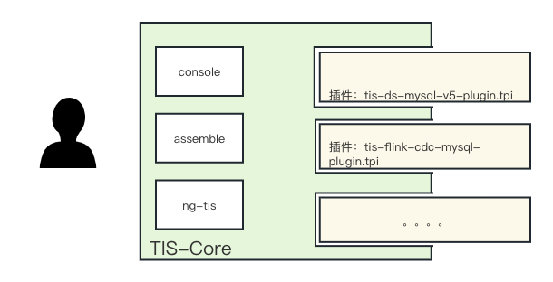

import Link from '/src/components/Link';
import Figure from '/src/components/Figure';
import CodeBlock from '@theme/CodeBlock';


export const CreateArchShell = () => {
return (
 <div>
  <CodeBlock language="shell">
  mvn com.qlangtech.tis:tis-archetype-generate-plugin:{metadata.version}:generate \{'\n'}
   -Drat.skip=true  \{'\n'}
   -Dtis.version={metadata.version} \{'\n'}
   -Dtis.extendpoint="com.qlangtech.tis.plugin.incr.TISSinkFactory:DB2SinkFactory;com.qlangtech.tis.async.message.client.consumer.impl.MQListenerFactory:FlinkCDCDB2SourceFactory" \{'\n'}
   -Dtis.artifactId=tis-flink-db2-plugin \{'\n'}
   -Ptis
  </CodeBlock>
 </div>
);
}

## TIS扩展点介绍

### 插件体系介绍

TIS是基于插件体系构建的，分为TIS-Core（https://github.com/datavane/tis） 与插件Plugins实现层（[https://github.com/qlangtech/plugins](https://github.com/qlangtech/plugins)）
，如下图：



如需要对TIS进行功能扩展，只需基于TIS提供的 <Link href={require("@site/docs/plugin/plugins.mdx")}>插件体系提供的扩展点</Link> 进行扩展，而不需要对TIS-Core层的任何代码进行修改。
这符合开放封闭原则(Open-Closed Principle，OCP)，即在TIS-Core不被修改的前提下被扩展新的功能。例如，需要在TIS中新添加一种新的数据类型，只需要新添加一个TPI插件包即可。

### 名词解释

* 扩展点（Extend Point）
   
    抽象类继承于（[Describable.java](https://github.com/datavane/tis/blob/master/tis-plugin/src/main/java/com/qlangtech/tis/extension/Describable.java)），开发者可理解成对于TIS内核层的
    一个扩展点，用户可以按照自己需要进行扩展
 
* 扩展实现：
  
    基于扩展点的具体实现

具体的`扩展点`与`扩展实现` 请查看<Link href={require("@site/docs/plugin/plugins.mdx")}>插件体系提供的扩展点</Link>

<Figure img={require('./img/plugins-relation.png')} />

开发者可以点击对应连接查看该扩展点或扩展实现的具体文档说明。

在使用TIS过程中用户已经发现，在每个功能页面中的头部位置也有`扩展实现`的标示，例如下图：

<Figure img={require('./img/plugins-ui.png')} />

在每个功能页面模块的右上角有该模块的实现类标示，用户可以点击该连接，查看该插件的说明文档，还能通过链接查看该`扩展实现`的Github原代码。

## TIS插件体系特点

TIS插件体系实现参照了CI/CD领域的Jenkins实现方式，和Jenkins一样TIS的产品功能流程是基于WBE-UI实现的，TIS内部已经实现了一套强大的前端UI自动化渲染机制。

后端开发工程师只需按照TIS开发规约，编写新的插件代码，不需要编写一行前端html或者js代码就能轻松构建一个新的插件，从而完成对TIS的功能扩展。

## TIS的插件开发步骤


### 确定需要扩展的扩展点

  通过 `名词解释` 一节中已经可以通过TIS现有的页面流程了解到，需要扩展的功能点的扩展点类的全路径。

### 创建插件脚手架工程

首先需要在 `$MAVEN_HOME/conf/setting.xml` 文件中添加 TIS的私有仓库Profile，配置如下所示：
```xml
<?xml version="1.0" encoding="UTF-8"?>
<settings>
 <profiles>
  <profile>
            <id>tis</id>
            <repositories>
               <repository>
                    <id>tis-releases</id>
                    <url>http://mvn-repo.oss-cn-hangzhou.aliyuncs.com/release/</url>
                </repository>
            </repositories>
            <pluginRepositories>
               <pluginRepository>
                    <id>tis-releases</id>
                    <url>http://mvn-repo.oss-cn-hangzhou.aliyuncs.com/release/</url>
                </pluginRepository>
            </pluginRepositories>
  </profile>
 </profiles>
</settings>
```

然后执行以下命令创建插件骨架工程：

  <CreateArchShell/>

  以上Command中两个参数需要说明
  1. **tis.extendpoint**
  
     **格式为:** 扩展点:扩展实现类名称[;扩展点:扩展实现类名称]+
  
     **扩展点**：<Link href={require("@site/docs/plugin/plugins.mdx")}>插件体系提供的扩展点和扩展实现</Link> 中的 1. 扩展点类 2. 扩展实现 3. 扩展实现类的继承链中的任一父类

     **扩展实现类名称**：新的扩展实现类名（符合Java类名命名规范即可）
  2. **tis.artifactId**
  
     新插件工程的名称，注意，该名称有`命名规范`，对于不同类型的插件包有不同的命名规范:
  
     |插件包类型| 类型说明 |项目名称命名规范|
     |-|-|-|
     | 增量同步| 只包含增量同步的`扩展实现` | 需符合正则 `tis-flink-([a-z,0-9,\-]+)-plugin` |
     | 批量同步| 只包含批量同步的`扩展实现` | 需符合正则 `tis-datax-([a-z,0-9,\-]+)-plugin`|
     | 其他| 既不包含 `增量同步` <br/> 也不包含 `批量同步` <br/> 的 `扩展实现` | 需符合增则 `tis-([a-z,0-9,\-]+)-plugin`|

  :::caution
  此外，`增量同步` 和 `批量同步` 的扩展实现不能共存于一个 插件工程中
  :::
  
  脚手架工程目录文件列表一览

    ```shell
     .
     |____pom.xml
     |____src
     | |____test
     | | |____java
     | | | |____TestAll.java
     | | | |____com
     | | | | |____qlangtech
     | | | | | |____tis
     | | | | | | |____async
     | | | | | | | |____message
     | | | | | | | | |____client
     | | | | | | | | | |____consumer
     | | | | | | | | | | |____impl
     | | | | | | | | | | | |____extend
     | | | | | | | | | | | | |____TestFlinkCDCDB2SourceFactory.java
     | | | | | | |____plugin
     | | | | | | | |____incr
     | | | | | | | | |____extend
     | | | | | | | | | |____TestDB2SinkFactory.java
     | |____main
     | | |____resources
     | | | |____com
     | | | | |____qlangtech
     | | | | | |____tis
     | | | | | | |____async
     | | | | | | | |____message
     | | | | | | | | |____client
     | | | | | | | | | |____consumer
     | | | | | | | | | | |____impl
     | | | | | | | | | | | |____extend
     | | | | | | | | | | | | |____FlinkCDCDB2SourceFactory.md
     | | | | | | | | | | | | |____FlinkCDCDB2SourceFactory.json
     | | | | | | |____plugin
     | | | | | | | |____incr
     | | | | | | | | |____extend
     | | | | | | | | | |____DB2SinkFactory.md
     | | | | | | | | | |____DB2SinkFactory.json
     | | |____java
     | | | |____com
     | | | | |____qlangtech
     | | | | | |____tis
     | | | | | | |____async
     | | | | | | | |____message
     | | | | | | | | |____client
     | | | | | | | | | |____consumer
     | | | | | | | | | | |____impl
     | | | | | | | | | | | |____extend
     | | | | | | | | | | | | |____FlinkCDCDB2SourceFactory.java
     | | | | | | |____plugin
     | | | | | | | |____incr
     | | | | | | | | |____extend
     | | | | | | | | | |____DB2SinkFactory.java
   ```
   以上shell command 会在本地中创建一个名叫tis-flink-db4-plugin的工程，实现了两个`扩展实现` 1. FlinkCDCDB2SourceFactory 2. DB2SinkFactory 分别实现了对DB2数据库的增量读和写功能

   |扩展点|`扩展实现`类|
   |-|-|
   |[MQListenerFactory](https://tis.pub/docs/plugin/plugins#comqlangtechtisasyncmessageclientconsumerimplmqlistenerfactory)|FlinkCDCDB2SourceFactory|
   |[TISSinkFactory](https://tis.pub/docs/plugin/plugins#comqlangtechtispluginincrtissinkfactory)|DB2SinkFactory|

   对于每一个扩展实现都有一组对应的文件与之对应，例如`DB2SinkFactory.java`文件来说，对应的属性描述文件有：
   1. `/src/main/resources/com/qlangtech/tis/plugin/incr/extend/DB2SinkFactory.json` 
       
       用于描述插件属性的，如：默认值，下拉框列表枚举，placeholder等
   2. `/src/main/resources/com/qlangtech/tis/plugin/incr/extend/DB2SinkFactory.md` 

      用户描述属性的基于MarkDown格式的帮助信息
   3. `/src/test/java/com/qlangtech/tis/plugin/incr/extend/TestDB2SinkFactory.java` 

      对应的单元测试文件

* 编写`扩展实现类`及相关

  以上由脚手架工程生成的三个文件，只是一个骨架，内容需要开发者进行扩充：
  1. 编写扩展实现类:  <Link href={require("@site/docs/develop/plugin-develop-detail.mdx")} anchor="编写扩展实现类">详细请查看</Link>
  2. 编写插件属性描述文件： <Link href={require("@site/docs/develop/plugin-develop-detail.mdx")} anchor="编写插件属性描述文件">详细请查看</Link>
  3. 编写属性富文本描述文件：<Link href={require("@site/docs/develop/plugin-develop-detail.mdx")} anchor="编写属性富文本描述文件">详细请查看</Link>
  4. 编写扩展实现类单元测试：<Link href={require("@site/docs/develop/plugin-develop-detail.mdx")} anchor="编写扩展实现类单元测试">详细请查看</Link>
  
* 本地测试插件
   
  本地运行
  ``` shell
  mvn com.qlangtech.tis:tis-archetype-run-plugin:run
  ```
  启动之后可通过 浏览器 `http://localhost:8080/` 打开TIS，在浏览器中进行集成测试

### 插件打包
  ``` shell
  mvn package -Dmaven.test.skip=true
  ```
  在本工程 tips目录中将生成一个后缀为`.tpi` 的文件，开发者可将该文件直接拷贝到 `$TIS_HOME/data/libs/plugins` 目录下，然后将TIS重启之后就可以直接使用该插件包中定义的扩展实现啦。
  如要实现，可以通过TIS插件池安装插件，需要转入下一步，`向TIS管理者提交合并申请`

### 向TIS管理者提交合并申请
  
  TIS每次发版会将TIS使用到的所有可用插件发布到TIS官方的插件仓库中，并且会基于这些插件包生成一份插件MetaData元数据清单文本，供后期本地TIS程序启动时加载使用。
  
  开发者如想将自己开发的插件包提交到TIS的中央插件仓库中，可以按如下流程操作：
  1. 将自己开发的插件工程提交到Github的本人拥有权限的repo中
  2. 在 https://github.com/datavane/tis/issues 中发起一个Issue，关于 `插件包提交到TIS的中央插件仓库`的申请，在Issue中需要说明该插件 实现的功能等信息
  3. 等待TIS管理者Review代码，如需需改代码，TIS管理者会主动通知，讨论后修改，最终由TIS管理者合并代码、发布。


