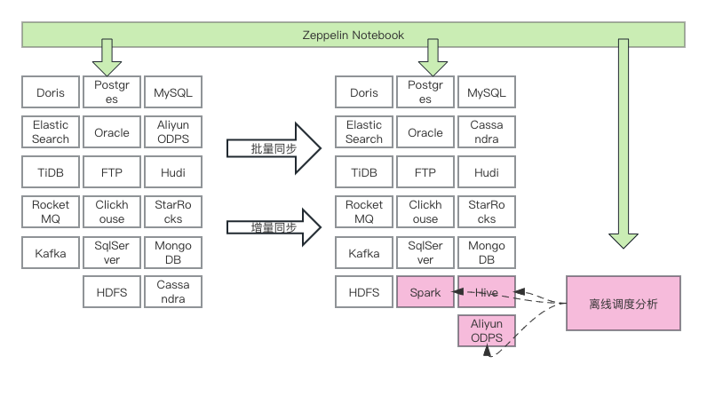
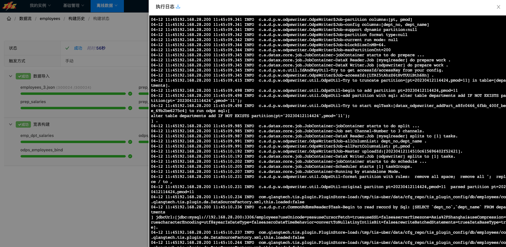
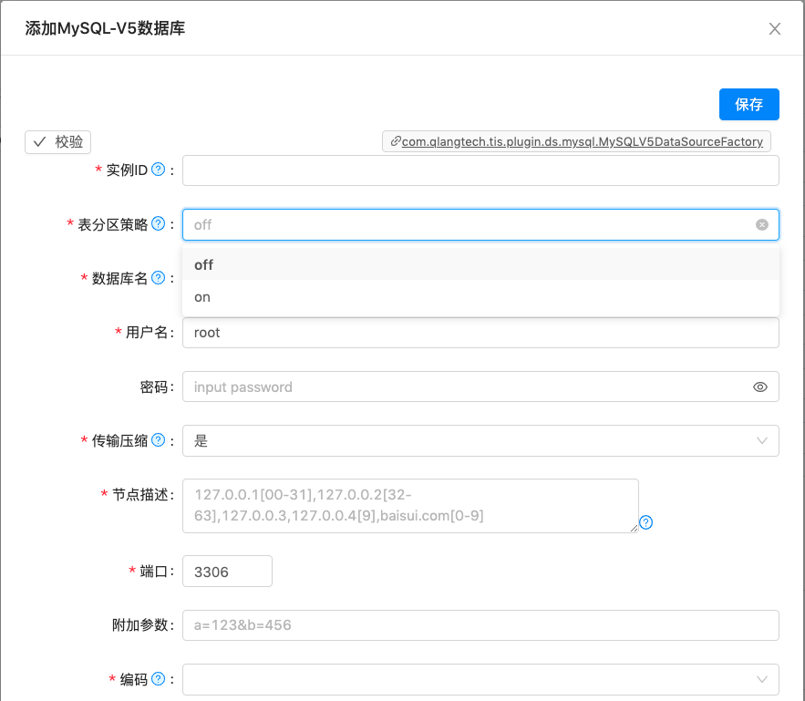
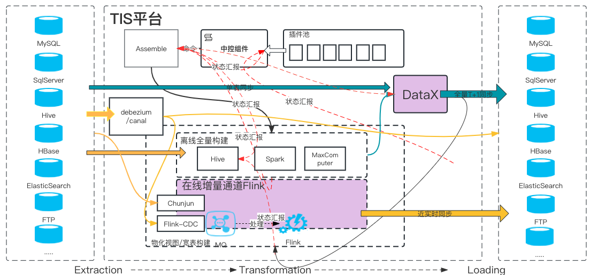

## TIS介绍

TIS起源于2016年，当时专注搜索引擎中台，为企业内部各个业务团队提供基于[Apache Solr](https://solr.apache.org/)的搜索服务，利用搜索引擎可以为企业内各业务方提供：
海量数据记录查询，个性化排序，OLAP分析统计等服务。

TIS负责从数据源中抽取原始数据，经过清洗，脱敏等处理操作将处理好的数据推送进Solr引擎，并且自研了一套流式引擎来保证数据源的数据与Solr引擎中的数据近实时同步。

那时只有少数几家互联网大厂拥有海量数据，且对实时性要求极高的实时OLAP分析场景，所以，利用搜索引擎来实现企业OLAP业务需求只在少数几家互联网大厂中流行。

随着时间来到2019年，物联网行业的兴起，传统企业面向海量数据业务场景开始变多，传统OLTP关系型数据库再也承担不了实时性的分析性查询。从那时起各种NoSQL的MPP引擎，例如TiDB，ClickHouse，Doris等优秀的产品如雨后春笋
般成长起来。依托于TIS已经成熟的为Solr引擎同步数据的产品设计方案，很自然地提出了从单一Sink端扩展到兼容行业其他数据端的需求。

从2019年起，TIS重新对底层架构进行设计和改造，致力于打造一款全新的基于DataOps理念的ELT数仓产品。经过3年多的持续改造，现已初步成型，想借此机会介绍给大家，希望能够借助社区的力量，持续优化，将TIS发扬光大。

目前，TIS已经支持Doris，ElasticSearch，TiDB，RocketMQ，Kafka，Postgres，Oracle，FTP，Clickhouse，SqlServer，HDFS，MySQL，AliyunODPS，Hudi，StarRocks，MongoDB，Cassandra 等数据端之间的数据同步
操作。

TIS在这些数据源之间提供了批量、增量同步通道，以及在部分数据类型如Spark、Hive、AliyunODPS之上的离线数据调度支持。

## TIS特点

TIS在整个产品设计、研发过程中立足于用户，需求实现完全以用户视角出发，用最简捷的方式，最大化地满足用户需求。在这一理念地加持下，TIS逐渐形成了自己地风格，得到了大部分种子用户肯定。例如有以下功能是TIS的特色：

### 基于App Store理念的插件池

大数据领域数据端产品特别丰富，例如：ElasticSearch、Doris、Clickhouse，FTP，MySQL、Oracle不胜枚举，据一个知名开源数据同步工具统计，他们内部已经集成了上百个数据Connector。
试想，用户试用TIS就需要下载一个包含所有功能实现的代码包到本地，那这个下载包必定是非常大，一般用户只会使用众多Connector中的某几个，但却要下载所有的功能
插件包，一来会浪费网络带宽，下载时间非常长，二来启动时加载不必要Connector组件而浪费计算机CPU/内存资源。

所以TIS在改造之初就借鉴安卓和苹果的AppStore的设计，借鉴了Jenkins的插件池实现方式。每次版本发布时会将所有的扩展插件放到TIS的中央仓库中，使用过程中用户只需到Plugin Store中选取需要的Connector插件，点击安装，安装完成
之后就能在TIS中热生效。

### 数据同步状态可视化

用户每次在执行批量任务导入过程中，可以通过TIS的界面，清楚直观地了解到任务执行的进度，执行器的JVM状态。任务如果失败，可以通过实时日志方便分析任务失败原因，让用户对于执行任务了若指掌。

### 基于UI的全流程包裹无微不至

用户在TIS构建数据同步任务，流程中需构建各种表单，每个表单都做到与内部语义模型高度一致，例如，TIS为各种JDBC构建的数据源UI模型，虽说，JDBC是一个标准化的语义模型，由jdbcURL、
用户名、密码、数据库名，驱动类名几个属性构成。

事实上，市面上很多ETL同步工具，会通过定义统一的数据源UI入口，在同一个页面上定义，jdbcURL、用户名、密码、数据库名，驱动类名来定义不同数据源。
这种实现方式当然是可以的，但是对使用者来说，会比较繁琐，因为每种数据源jdbcURL规则有所不同，另外，有的数据库，例如MySQL是没有schema概念的，而PostgreSQL、
Oracle是有schema概念的，并且，Oracle的连接分`SID`和`ServiceName`两种方式，不同的方式，jdbcURL的拼写规则是不同的。

所以，很难用一个数据源定义页面达到通用性。

因此，TIS中为每种类型的数据源都定制了一套与该数据源特性匹配的UI组件。以下是MySQL和Oracle的数据源定义的效果对比：

| MySQL数据源定义           | Oracle数据源定义           |
|----------------------|-----------------------|
|  |  |

数据源定义只是TIS中众多模块中的之一，其他模块亦是如此。

## TIS的愿景

TIS的愿景是，提供一站式人人会用的数据集成产品。致力于打造一款全新的基于DataOps理念的ETL数仓产品。

或许您对DataOps还没有具体了解，这里给出几个评判是否达到DataOps标准的评判依据：

1. 是否能职责解耦
 
   大数据领域从业者可分为`大数据开发工程师`，`数据分析师` 等，`数据分析师`偏重于业务，`大数据开发工程师`偏重于技术，系统是否可以让这两种角色工作时不需要任何交互，而能各自完成自己的任务。

2. 是否能最大限度地屏蔽产品底层技术细节

   用户是否需要了解产品底层实现，例如，用户在执行批量数据同步过程时，不需要了解底层是基于DataX，或者SeaTunnel来实现的，他只需要知道需要同步的数据源
   地址和目标数据源地址就行了。实时同步数据时也不需要了解底层时Flink来实现的，在界面操作过程中也压根体会不到Flink存在。

3. 是否最大限度地利用了数据的元数据信息来实现自动化

   用户在产品上的操作，无形中有一个类似Suggest的工具利用数据的元数据信息，帮你生成各种候选相，用户所要作的就是持续地在各种候选项中作选择，来实现最终的任务。
   更具体的描述是全程只需要鼠标点点，很少用到键盘了。

## TIS的设计

上图，左测为Source数据端，右侧为Sink数据端。数据的是通道分为两种通道，一条是以DataX来实现的批量数据通道，一条是以Flink来实现的增量数据通道，即经典的Delta架构的数仓。

TIS要面向各种应用场景，例如，用户只需要T+1的数据分析，或者，只是数据备份与恢复操作，那么只需使用批量数据同步即可，优点是成本地，性能高效。
如用户需要进行实时数据分析，那就可以开启利用Flink实现的实时数据同步管道。

## TIS相关链接

* GitHub地址 https://github.com/qlangtech/tis
* Gitee地址 https://gitee.com/qlangtech/tis
* TIS 官网 https://tis.pub

